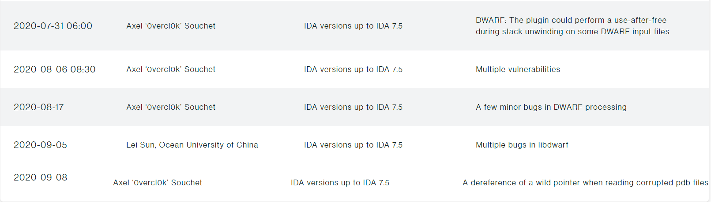

# Fuzzing IDA75

This repository has every crashing files that I reported to Hexrays in 2020 when I was fuzzing the ELF and PDB loaders.

If you are curious about this effort, read up [Building a new snapshot fuzzer & fuzzing IDA](https://doar-e.github.io/blog/2021/07/15/building-a-new-snapshot-fuzzer-fuzzing-ida/).

- [Infinite loop in dwarf64](dwarf64-dos-infloop/),
- [Stack-overflow in dwarf64](dwarf64-dos-stackov/),
- [Double-free in dwarf64](dwarf64-doublefree/),
- [interr 76C1 in dwarf64](dwarf64-interr76C1/),
- [Out-of-bounds in dwarf64](dwarf64-oob-1/),
- [Use-after-free in dwarf64](dwarf64-uaf/),
- [Use-after-free write in dwarf64](dwarf64-uaf-write-75eaf075/),
- [Division by zero in elf64](elf64-dos-divzero/),
- [interr 4E6E in elf64](elf64-interr4E6E/),
- [Near null dereference in libdwarf64](libdwarf64-nearnull-dwarf_errmsg/),
- [Out-of-bounds in libdwarf64!dwarf_set_stringcheck](libdwarf64-oob-dwarf_set_stringcheck/),
- [Out-of-bounds in libdwarf64!dwarf_siblingof_b](libdwarf64-oob-dwarf_siblingof_b/),
- [Out-of-bounds in libdwarf64!dwarf_types_dealloc](libdwarf64-oob-dwarf_types_dealloc/),
- [Out-of-bounds in libdwarf64!dwarf_srclines_dealloc](libdwarf64-oob-memcpy/),
- [Double free in libdwarf64!dwarf_loclist_n](libdwarf-doublefree/),
- [Out-of-bounds in pdb64](pdb64-oob/),
- [Use-after-free in pdb64](pdb64-uaf/).

All of the above have been fixed by the IDA team in 2020 and I thank them for handling and addressing those reports super fast.
